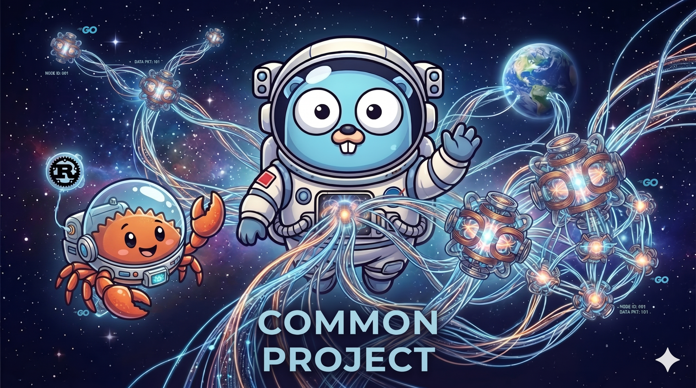

> **⚠ Work in progress — not functional yet.**
> The codebase is under active development. APIs, config schemas, and build
> steps will change without notice. Do not use in production.

# cmn-weave

**cmn-weave** is a distributed task execution framework that lets a single operator
securely dispatch commands to one or more remote agents and collect results —
all over mutually-authenticated TLS, with no user-management layer.



<sub>
The Go gopher was designed by <a href="https://reneefrench.blogspot.com/">Renée French</a>, licensed under <a href="https://creativecommons.org/licenses/by/4.0/">CC BY 4.0</a> (<a href="https://go.dev/brand">Go Brand Book</a>).
Ferris the crab (Rust mascot) was created by Karen Rustad Tölva, released under <a href="https://creativecommons.org/publicdomain/zero/1.0/">CC0 1.0</a> (<a href="https://foundation.rust-lang.org/policies/logo-policy-and-media-guide/">Rust Media Guide</a>).
</sub>


---

Distributed processing system composed of three components communicating
exclusively over mutually-authenticated TLS:

```
+--------+   REST/HTTPS (mTLS)   +--------+   gRPC/HTTPS (mTLS)   +-------+
| client | ───────────────────▶ | server | ────────────────────▶ | agent |
+--------+                       +--------+                        +-------+
```

- **client** — CLI that submits work to the server.
- **server** — REST API gateway; validates the request and dispatches to one
  or more agents via gRPC.
- **agent** — gRPC service that executes the work, with a Rust execution
  core linked in via cgo.

## Repository layout

```
cmd/
  server/   REST API binary
  agent/    gRPC binary (links Rust core via cgo)
  client/   CLI binary
pkg/
  config/   Configuration loader and unified YAML schema
  global/   Process-wide singletons (logger)
  server/   REST router, controllers, mTLS middleware, tlsutil helper
  agent/
    grpc/proto/  .proto sources (single source of truth for gRPC API)
    grpc/auto/   Generated Go stubs and Rust FFI bindings (do not edit)
    rust/        Rust crate built as a staticlib and linked via cgo
etc/
  server/   Server config example and TLS material
  agent/    Agent config example and TLS material
  client/   Client config example and TLS material
  common/   Shared CA certificate
docker/     Container build helpers and runtime configs
```

## Build

```sh
# Prerequisites: Go, Rust (cargo), protoc + protoc-gen-go + protoc-gen-go-grpc

# Regenerate gRPC stubs
make proto

# Build Rust core staticlib
make core

# Build all Go binaries
make build
```

See [.github/instructions/general.instructions.md](.github/instructions/general.instructions.md)
for the full design policy and coding conventions.

